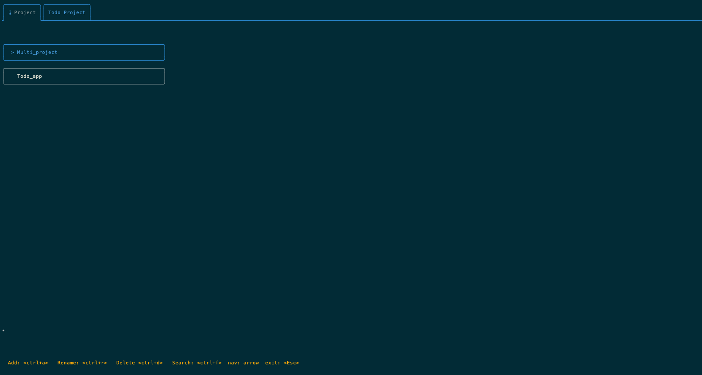
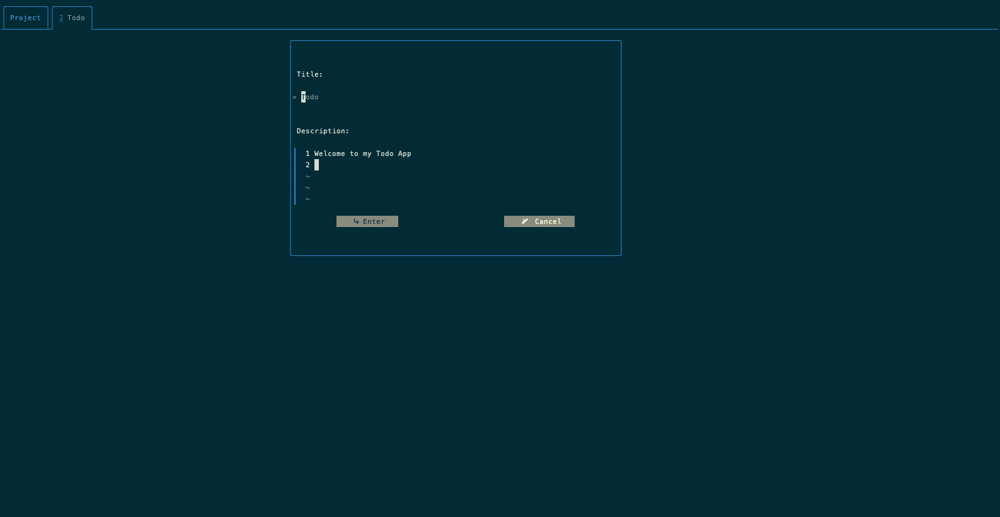
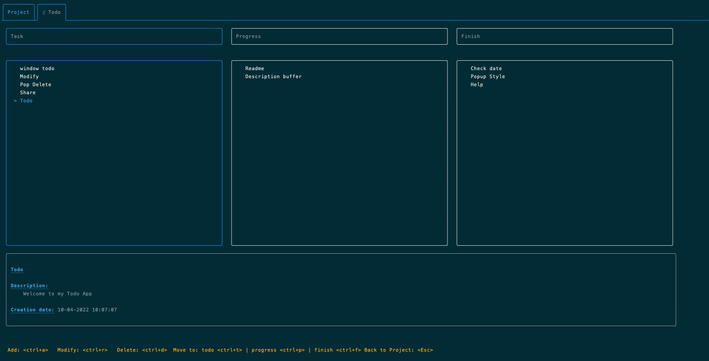

# Todo App

##Todo manager in your Terminal

##install
```bash
https://github.com/waxdred/TodoApp.git todo

#add todo in your PATH 
#or run ./bin/todo
```

## The Todo are saved in the directory
```
~/.config/todo/
```

## Project manager


## Add Todo


## Todo manager

## Authors
- [@waxdred](https://www.github.com/waxdred)
